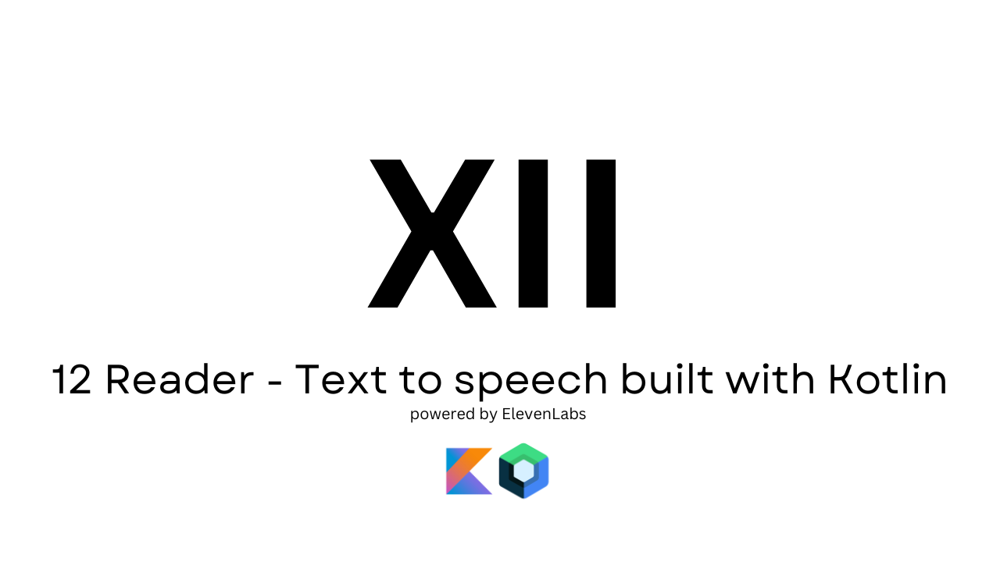

# **12Reader**

Text to speech app build using Jetpack Compose and powered by [ElevenLabs](https://elevenlabs.io/docs)

## Built With 🛠

- [Kotlin](https://kotlinlang.org/) - First class and official programming language for Android
  development.
- [Jetpack Compose](https://developer.android.com/jetpack/compose) - Jetpack Compose is Android’s
  modern toolkit for building native UI
- [Coroutines](https://kotlinlang.org/docs/reference/coroutines-overview.html) - For asynchronous
  and more.
- [Ktor Client](https://ktor.io/docs/client-create-new-application.html) - Ktor includes a multiplatform asynchronous HTTP client, which allows you to make requests and handle responses, extend its functionality with plugins, such as authentication, JSON serialization, and more.
- [Flow](https://kotlin.github.io/kotlinx.coroutines/kotlinx-coroutines-core/kotlinx.coroutines.flow/-flow/)
    - A cold asynchronous data stream that sequentially emits values and completes normally or with
      an exception.
- [StateFlow](https://developer.android.com/kotlin/flow/stateflow-and-sharedflow) - StateFlow is a
  state-holder observable flow that emits the current and new state updates to its collectors.
- [Android Architecture Components](https://developer.android.com/topic/libraries/architecture) -
  Collection of libraries that help you design robust, testable, and maintainable apps.
    - [ViewModel](https://developer.android.com/topic/libraries/architecture/viewmodel) - Stores
      UI-related data that isn't destroyed on UI changes.
- [Dependency Injection](https://developer.android.com/training/dependency-injection) -
    - [Koin](https://insert-koin.io/) - A framework to help you build any kind of Kotlin & Kotlin Multiplatform application, from Android mobile, Multiplatform apps to backend Ktor server applications.
 
## Let's Connect 👋🏼

connect with me here [LinkedIn](https://www.linkedin.com/in/mathroda/) .

# License

```xml
Copyright 2022 MathRoda, Inc. All Rights Reserved.

Licensed under the Apache License, Version 2.0 (the "License");
you may not use this file except in compliance with the License.
You may obtain a copy of the License at

   http://www.apache.org/licenses/LICENSE-2.0

Unless required by applicable law or agreed to in writing, software
distributed under the License is distributed on an "AS IS" BASIS,
WITHOUT WARRANTIES OR CONDITIONS OF ANY KIND, either express or implied.
See the License for the specific language governing permissions and
limitations under the License.
```
